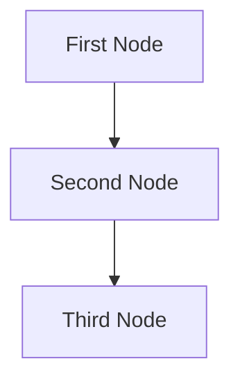

# Design Doc: AI Paul Graham

> Please DON'T remove notes for AI

## Requirements

> Notes for AI: Keep it simple and clear.
> If the requirements are abstract, write concrete user stories


Create an AI chatbot that answers question in Paul Graham's style using his essays as source material.

- Data Source

   Use Paul Graham's essays in ./data

- Technical Approach
   Implement retrieval-augmented generation (RAG)
   Break essays into small text chunks
   Retrieve top 5 most relevent chunks when answering questions

- Conversational Tone
   Make concise responses(< 50 words) sound like Paul Graham


## Flow Design

> Notes for AI:
> 1. Consider the design patterns of agent, map-reduce, rag, and workflow. Apply them if they fit.
> 2. Present a concise, high-level description of the workflow.

### Applicable Design Pattern:

1. Map the file summary into chunks, then reduce these chunks into a final summary.
2. Agentic file finder

### Flow high-level Design:

1. **First Node**: This node is for ...
2. **Second Node**: This node is for ...
3. **Third Node**: This node is for ...


## Utility Functions

> Notes for AI:
>
> 1. Understand the utility function definition thoroughly by reviewing the doc.
> 2. Include only the necessary utility functions, based on nodes in the flow.

Based on the RAG implementation requirements, the following utility functions are necessary:

1. `read_essays.py`
   - Input: Directory path
   - Output: Dictionary of essay texts with filenames as keys
   - Necessity: Reads Paul Graham essays from the data directory

2. `chunk_text.py`
   - Input: Text content
   - Output: List of text chunks (paragraphs or semantic chunks)
   - Necessity: Breaks essays into smaller, manageable chunks for processing

3. `get_embedding.py`
   - Input: Text chunk
   - Output: Vector embedding
   - Necessity: Converts text chunks into vector embeddings for semantic search

4. `vector_store.py`
   - Functions:
     - `create_index(chunks, embeddings)`: Creates vector index from chunks and embeddings
     - `search_index(query_embedding, top_k=5)`: Retrieves most relevant chunks
   - Necessity: Stores and retrieves vectors efficiently

5. `call_llm.py`
   - Input: Prompt with question and context chunks
   - Output: Response text in Paul Graham's style
   - Necessity: Generates final response using retrieved context
   - Implementation: Uses OpenAI's GPT-4o model for generation

6. `style_formatter.py`
   - Input: Raw LLM response
   - Output: Concise, Paul Graham-styled text (<50 words)
   - Necessity: Ensures responses maintain the desired style and length

## Node Design

### Shared Memory

> Notes for AI: Try to minimize data redundancy

The shared memory structure is organized as follows:

```python
shared = {
    "key": "value"
}
```

### Node Steps

> Notes for AI: Carefully decide whether to use Batch/Async Node/Flow.

1. First Node

2. Second Node
